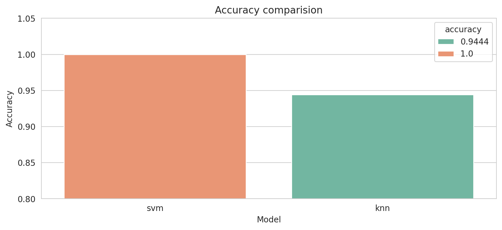
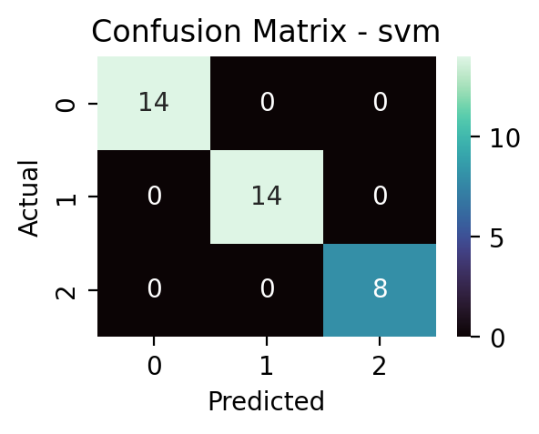

# 🍷 Wine class Prediction using Support Vector Machines (SVM), and K-Nearest Neighbors (KNN)

This project focuses on classifying the cultivar (variety) of wine based on it's chemical properties from the `Wine dataset` provided by `sklearn.datasets.load_wine()`. Two classification machine learning models are used to compare them, Support Vector Machines (`SVM`), and K-Nearest Nesighbors (`KNN`). The project is hosted with [Streamlit](https://wine-class-prediction.streamlit.app/).

<p align="center">
    
</p>

---

## 💻 About the dataset

The wine data is the results of a chemical analysis of wines grown in the same region in Italy by three different cultivators. There are thirteen different measurements taken for different constituents found in the three types of wine.

Summary of the dataset

| Feature                    | Description                                                                        | min    | mean   | max     |
| -------------------------- | ---------------------------------------------------------------------------------- | ------ | ------ | ------- |
| **alcohol**                | Alcohol content in the wine.                                                       | 11.03  | 13.00  | 14.83   |
| **malic_acid**             | Naturally occurring acid found in grapes that contributes to the sour taste.       | 0.74   | 2.33   | 5.80    |
| **ash**                    | Inorganic residue remaining after all organic matter is burned away from wine.     | 1.36   | 2.36   | 3.23    |
| **alcalinity_of_ash**      | Total amount of alkaline substances that remain after the wine is burned to ash.   | 10.60  | 19.49  | 30.00   |
| **magnesium**              | Nutrient for grapevines and yeast during fermentation.                             | 70.00  | 99.74  | 162.00  |
| **total_phenols**          | Contributes to the taste (bitterness) and antioxidant properties.                  | 0.98   | 2.29   | 3.88    |
| **flavanoids**             | Group of naturally occurring polyphenols, that contribute to its color, and taste. | 0.34   | 2.02   | 5.08    |
| **nonflavanoid_phenols**   | Group of phenolic compounds that are not flavonoids.                               | 0.13   | 0.36   | 0.66    |
| **proanthocyanins**        | Type of polyphenol found in wine, that impact its sensory properties.              | 0.41   | 1.59   | 3.58    |
| **color_intensity**        | Intensity of the wine color.                                                       | 1.28   | 5.05   | 13.00   |
| **hue**                    | Shade/tone of the color.                                                           | 0.48   | 0.95   | 1.71    |
| **od315_of_diluted_wines** | Absorbance ratio used to estimate wine quality.                                    | 1.27   | 2.61   | 4.00    |
| **proline**                | Amino acid found in wine and contributes to sweetness, viscosity, and fullness.    | 278.00 | 746.89 | 1680.00 |
| **target**                 | Target class (cultivar) of the wine (class 0, 1, or 2)                             |        |        |         |

---

## ⚙️ Workflow of the project

-   **Loading dataset**: The dataset is loaded as a pandas `DataFrame` object from `sklearn.datasets.load_wine()`.
-   **EDA**: A little analysis is done to see what's in the data.
-   **Split**: Since there were no missing or duplicate data, the data is split into train (80%) and test (20%) set.
-   **Train the models**:
    1. _SVM_: A simple SVM model from `sklearn.svm.SVC()` is used to train the model using default parameters.
    2. _KNN_: A model of K-Nearest Neighbors from `sklearn.neighbors.KNeighborsClassifier()` is trained using a `n_neighbors` value of 3.
-   **Initial Results**: The results are not that prominent because we didn't use any preprocessing techniques.
    1. _SVM_: An accuracy of `81%` was reached when evaluated on the test set which had 36 records.
    2. _KNN_: KNN reached an accuracy of `81%` from the same test set.
-   **Preprocessing**: `Z-score` normalization technique is used as `scaler` to rescale data to have a mean of 0, and standard deviation of 1.
-   **Scaled Results**:
    1. _SVM_: SVM reached an accuracy increased to `100%`, whcih is prominent.
    2. _KNN_: Accuracy of `94%` is achived after Z-score normalization was used.
-   **Saving models**: The two models and scaler is saved into a `pickle` file using joblib.
-   **Website**: The models are hosted using `Streamlit`. Users can go to the website and enter wine details and get output prediction of class 0, 1, or 2.

---

## 📊 Visualizations

<h3 align="center">Accuracy Comparision</h3>
<p align="center">
    
</p>

<h3 align="center">Confusion matrix - SVM</h3>
<p align="center">
    
</p>

<h3 align="center">Confusion matrix - KNN</h3>
<p align="center">
    
</p>

---

## 📦 How to run

1. Clone this repository

```bash
git clone https://github.com/Koustav2908/wine-class-prediction
```

2. Install the libraries

```bash
pip install -r requirements.txt
```

3. Run the notebook

```bash
# click `Run All` in `train.ipynb` file
```

4. Run the streamlit app (locally)

```bash
streamlit run app.py
```
